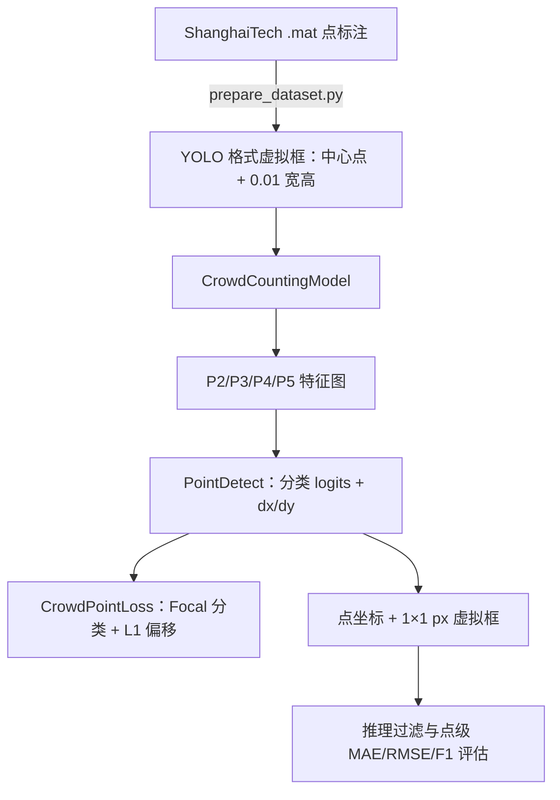

# 人群计数模型整理报告（当前 v4 实现）

本文以当前代码为准，说明基于 YOLO11 的点检测式人群计数模型、训练损失和评估边界。

## 1. 系统概览

模型仅学习人头中心点，不学习真实边界框宽高。ShanghaiTech 的点标注会先转换为 YOLO 格式的**虚拟框**，但虚拟框只用于复用数据加载流程；自定义模型的训练损失只使用其中心坐标。



## 2. 当前模型实现

### 2.1 网络

- 配置：`models/yolo11-crowd.yaml`。
- Backbone 使用 YOLO11n 风格的第 0–10 层；训练器会尝试从本地 `yolo26n.pt` 载入这些层中形状一致的参数。
- Neck 输出四个尺度：P2/4、P3/8、P4/16、P5/32。
- `CrowdCountingModel` 会把 YAML 解析得到的原生 `Detect` 头替换为 `PointDetect`。

### 2.2 PointDetect

每个尺度的每个网格输出：

- 1 个分类 logit，表示该锚点是否预测人头；
- 2 个未约束偏移量 `(dx, dy)`。

推理时的点坐标为：

$$
P = (A + (dx,dy)) \times s
$$

其中 `A` 为带有 `0.5` 偏移的特征图网格中心，`s` 为该层 stride。为了经过 Ultralytics 的通用后处理，点会临时打包为 `(x, y, 1, 1)` 的 1 像素虚拟框。

## 3. CrowdPointLoss（v4）

当前总损失为：

$$
L = 1.0L_{cls} + 5.0L_{off}
$$

第三个 loss slot 仅为兼容训练器保留，恒为 0。此前的全局计数损失已移除：训练初期全图概率求和过大，会向分类分支施加不区分正负样本的强梯度。

### 3.1 匹配策略

对每个 GT 点，计算其与 P2–P5 全部锚点中心的欧氏距离：

1. 选择距离最近的 Top-K 个锚点，当前 `K=3`；
2. 对每一个候选配对，以 `1.5 × 该锚点 stride` 作为距离阈值；
3. 通过阈值的锚点为正样本，分类目标为 1；其余为背景；
4. 偏移目标为 `GT / stride - anchor`。

若多个 GT 匹配同一锚点，它们的偏移目标会分别参与偏移损失，不再取平均或相互覆盖。一个锚点仍只能输出一个点，因此这类碰撞仍是高密度场景的结构性限制。

### 3.2 子损失

- `L_cls`：`BCEWithLogitsLoss` 加 Focal 权重，`gamma=2.0`、`alpha=0.25`；按正样本数归一化后乘以 20。
- `L_off`：仅在正锚点上计算预测偏移与目标偏移的逐元素 L1 均值，最终乘以 5。

## 4. 数据与输入规模

训练数据为 ShanghaiTech Part A 与 Part B 的组合数据集。标签行是：

```text
0  nx  ny  0.010000  0.010000
```

当前 v4 训练配置使用 `imgsz=1024`。此时四层共有 87,040 个锚点：P2 65,536、P3 16,384、P4 4,096、P5 1,024。文档或旧实验中出现的 640 输入/34,000 锚点不适用于 v4 配置。

## 5. 评估说明与已知限制

应以点级指标为准：人数 MAE/RMSE，以及给定像素容忍距离下的一对一匹配 Precision、Recall 和 F1；相关脚本包括 `scripts/evaluation/count.py`、`scripts/evaluation/detailed.py` 与 `scripts/evaluation/compare_localization.py`。

不要用训练日志里的标准 YOLO `Box(P/R/mAP)` 作为此模型的有效结论。标签虚拟框约为图像宽高的 1%，而自定义头推理输出固定 1×1 px 框；即便中心点重合，二者 IoU 通常也远低于标准 mAP 阈值，因此这些框指标可能始终为 0。

此外，标准 NMS 只是为了复用接口，并非针对点集设计的去重/计数策略。置信度阈值、最大检测数和点级去重半径都会直接改变最终计数，实验报告应固定并记录这些参数。
