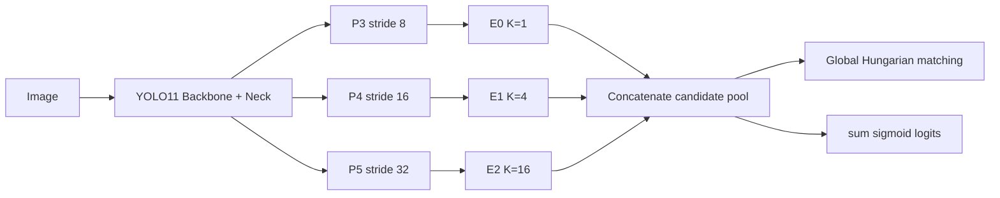

# Native Multiscale Point Model

## 1. 目标

模型只预测人头中心点，不回归框。YOLO11 Backbone+Neck 输出 P3/P4/P5，native point head 在三个原生尺度上独立预测候选点，再合并候选池。



## 2. 原生多尺度 Head

默认输入为 640×640：

| Expert | Feature | Grid | K | Candidates | Reference spacing |
| --- | --- | ---: | ---: | ---: | ---: |
| E0 | P3 | 80×80 | 1 | 6400 | 8px |
| E1 | P4 | 40×40 | 4 | 6400 | 8px |
| E2 | P5 | 20×20 | 16 | 6400 | 8px |

每个 Expert 输出 confidence、dx、dy。reference point 使用本层自己的 grid：

```text
base_point = (grid + reference_offset) × stride
point = base_point + tanh(offset) × 2 × (stride / sqrt(K))
```

因此三个 Expert 的 effective stride 都约为 8px，最大细调范围都约为 ±16px。

模型输出：

```text
logits          [B, Q]
points          [B, Q, 2]
base_points     [B, Q, 2]
expert_indices  [B, Q]
expert_logits   tuple(E0, E1, E2)
expert_points   tuple(E0, E1, E2)
```

`expert_indices` 是候选的真实来源，训练、评估和可视化统一使用该字段。

## 3. Matching 与损失

### 3.1 Independent warmup

前 N 个 epoch，每个 Expert 只在自己的候选子池内独立 Hungarian matching。三个 Expert 都学习分类、定位和计数。

### 3.2 Global competition

warmup 后将三个候选子池合并。对每张图执行一次全局 matching：
Global competition first performs expert-balanced confidence preselection. The
`match_top_k` budget is split as evenly as possible across E0/E1/E2, then the
remaining candidates are matched globally:

```text
cost = 5.0 × normalized_L1_position_error - 0.25 × confidence
```

Both weights are checkpoint configuration fields. Each GT has one winner
candidate; other Expert candidates remain negative samples.

### 3.3 Task loss

```text
L = L_cls + 5 × L_point + 0.05 × L_count
```

- `L_cls`：sigmoid focal loss。
- `L_point`：matched point 的 normalized Smooth L1。
- `L_count`：`abs(sum(sigmoid(logits)) - n_gt) / (n_gt + 1)`。

## 4. 训练与评估

训练入口：

```bash
python -m scripts.training.train_moe \
    --native-references 1,4,16
```

当前 CLI 已简化为 native-only；不存在 Router、Drop-1、Top-2、Top-1 或尺度路由监督参数。checkpoint 配置固定记录：

```text
architecture = native_multiscale
native_references = [1, 4, 16]
matching_schedule = independent_per_expert_then_global_hungarian
```

计数始终使用候选池全部 logits 的 sigmoid 和。训练与评估记录每个 Expert 的 winner 比例、matched distance、matched confidence 和 positive count。
