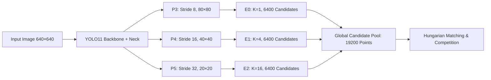
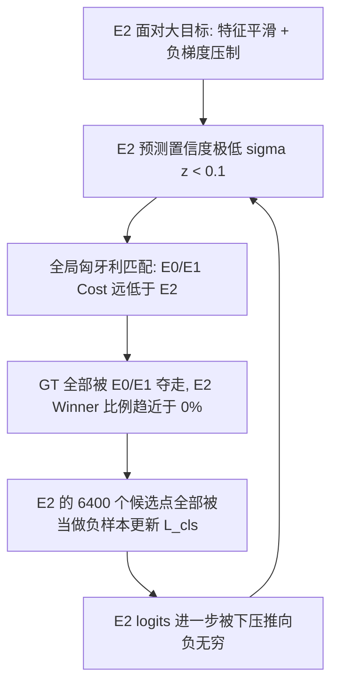
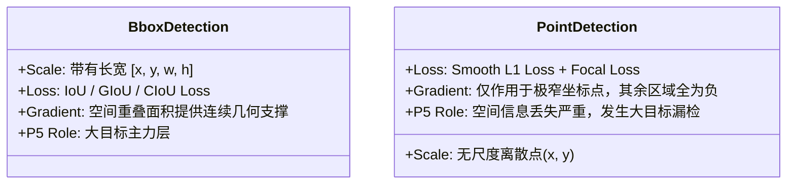

# E2 专家对大尺寸目标严重漏检的数学机理分析

## 1. 概述与问题背景

在原生多尺度点检测模型（Native Multiscale Point Model）中，模型通过 YOLO11 Backbone + Neck 分别在 P3、P4、P5 三个特征层提取特征，并由对应的三个点检测专家（E0、E1、E2）独立预测候选点：



三个专家的设计参数配置如下：

| Expert | 特征层 | 特征图分辨率 | 步长 (Stride) | 网格候选数 ($K$) | 总候选点数 | 有效参考间距 | 细调范围 |
| :--- | :--- | :--- | :--- | :--- | :--- | :--- | :--- |
| **E0** | P3 | $80 \times 80$ | 8 | 1 | 6400 | 8 px | $\pm 16\text{ px}$ |
| **E1** | P4 | $40 \times 40$ | 16 | 4 | 6400 | 8 px | $\pm 16\text{ px}$ |
| **E2** | P5 | $20 \times 20$ | 32 | 16 | 6400 | 8 px | $\pm 16\text{ px}$ |

在传统目标检测（如基于 Bounding Box 的 YOLO）中，深层大步长特征层（P5）由于具有超大感受野，通常是负责检测**大尺寸目标**的主力层；然而在单专家消融实验与多专家联合评估中，**E2 在稀疏、大尺寸目标集（如 ShanghaiTech Part B）上却表现出严重的漏检与预测总数腰斩**（GT = 5379，E0 预测 5315.6，E1 预测 4568.5，而 E2 仅预测 2653.1）。

本文从**损失函数梯度动力学**、**空间特征表征**、**匈牙利匹配机制**与**监督信号本质**四个数学维度，全面剖析 E2 针对大尺寸目标严重漏检的根本原因。

---

## 2. 数学机理剖析

### 2.1 空间特征复用与 Focal Loss 下的负梯度淹没（Gradient Conflict）

#### 1. 前向传播与特征共享
对于输入图像，E2 的特征图大小为 $\frac{H}{32} \times \frac{W}{32}$。每个网格单元 $(i, j)$ 对应原图上 $32 \times 32$ 像素的物理区域。
在网格 $(i, j)$ 处，卷积特征提取器输出单一特征向量 $\mathbf{h}_{i, j} \in \mathbb{R}^C$。E2 通过 $1 \times 1$ 卷积同时预测 16 个参考点的分类 logits：
$$z_{i, j, k} = \mathbf{w}_k^T \mathbf{h}_{i, j} + b_k, \quad k \in \{1, 2, \dots, 16\}$$
其中 $\sigma(z_{i, j, k})$ 为第 $k$ 个候选点的置信度。

#### 2. 大目标的标签分配稀疏性
假设图像中存在一个大尺寸目标（例如头部直径 $D \approx 100\text{ px}$）：
- 该目标在空间上覆盖了约 $3 \times 3$ 个 $P_5$ 特征网格单元（即 $3 \times 3 \times 16 = 144$ 个 E2 候选点）；
- 但点检测（Point Detection）给出的 Ground Truth 只是一个无维度的离散几何点 $\mathbf{g} = (x_{\text{gt}}, y_{\text{gt}})$；
- 在 Hungarian 匹配下，**这 144 个候选点中仅有 1 个点（设为网格 $(i^*, j^*)$ 中的第 $k^*$ 个点）被标记为正样本（$y_{k^*}=1$）**；
- 同一网格内的其余 15 个点以及邻近 8 个网格内的全部 128 个点，其监督标签全部为 **负样本（$y=0$）**。

#### 3. Focal Loss 的梯度推导
二值 Sigmoid Focal Loss 定义为：
$$L_{\text{cls}}(z, y) = \begin{cases} -\alpha (1 - \sigma(z))^\gamma \log \sigma(z), & y = 1 \\ -(1-\alpha) \sigma(z)^\gamma \log(1 - \sigma(z)), & y = 0 \end{cases}$$
其对 logit $z$ 的导数可精确表示为：
$$\frac{\partial L_{\text{cls}}}{\partial z} = \begin{cases} \alpha (1 - \sigma(z))^\gamma \left[ \gamma \sigma(z) \log \sigma(z) + \sigma(z) - 1 \right] < 0, & y = 1 \quad (\text{激发项，驱动 } z \to +\infty) \\ (1-\alpha) \sigma(z)^\gamma \left[ 1 - \sigma(z) - \gamma \sigma(z) \log(1-\sigma(z)) \right] > 0, & y = 0 \quad (\text{抑制项，驱动 } z \to -\infty) \end{cases}$$

#### 4. 反向传播梯度合成与冲突
反向传播至特征向量 $\mathbf{h}_{i^*, j^*}$ 的总分类梯度为：
$$\frac{\partial L_{\text{cls}}}{\partial \mathbf{h}_{i^*, j^*}} = \underbrace{\frac{\partial L_{\text{cls}}}{\partial z_{k^*}} \mathbf{w}_{k^*}}_{1 \text{ 个正样本激发项}} + \underbrace{\sum_{k \neq k^*}^{16} \frac{\partial L_{\text{cls}}}{\partial z_k} \mathbf{w}_k}_{15 \text{ 个负样本抑制项}}$$

对于处于大目标内部的邻域网格 $(i, j) \neq (i^*, j^*)$，其梯度完全由 16 个负样本项构成：
$$\frac{\partial L_{\text{cls}}}{\partial \mathbf{h}_{i, j}} = \sum_{k=1}^{16} \frac{\partial L_{\text{cls}}}{\partial z_k} \mathbf{w}_k \quad (\text{纯负向抑制})$$

#### 5. 结论
由于大尺寸目标在局部占据多个像素单元，却只有单点正监督，导致**大尺寸目标特征被包围在极其密集（15:1 甚至 143:1）的负样本梯度场中**：
$$\left\| \sum \text{Negative Gradients} \right\| \gg \left\| \text{Positive Gradient} \right\|$$
网络特征提取器 $\mathbf{h}$ 被迫学习将“大目标纹理特征”全部映射为负输出，导致 E2 在面对大尺寸目标时发生置信度系统性坍塌（Confidence Collapse）。

---

### 2.2 感受野低频平滑与狄拉克 $\delta$ 监督的空间去歧义失效

#### 1. 空间响应函数差异
- **小目标**：尺度较小（$8 \sim 16\text{ px}$），在特征图上呈现局部的锐利脉冲（Dirac-like peak $\delta(x - x_0)$）；
- **大目标**：尺度较大（$D > 64\text{ px}$），在 $P_5$（理论感受野 $RF > 250\text{ px}$，有效感受野跨越数十个像素）中经过多层卷积池化后，高频几何边缘被高度平滑，呈现为一个**广延而平坦的低频响应平台（Flat Response Plateau）**：
  $$\mathbf{h}_{i, j} \approx \mathbf{h}_0, \quad \forall (i, j) \in \Omega_{\text{LargeTarget}}$$

#### 2. 通道固定投影的表达瓶颈
E2 尝试利用静态的 $1 \times 1$ 卷积权重矩阵 $\mathbf{W} = [\mathbf{w}_1, \mathbf{w}_2, \dots, \mathbf{w}_{16}]^T$ 在**完全均质平坦的特征输入 $\mathbf{h}_0$** 上解耦出 16 个精确空间点位：
$$z_k = \mathbf{w}_k^T \mathbf{h}_0 + b_k$$
由于 $\mathbf{w}_k$ 是对整个数据集统计拟合的固定参数，并不具备根据当前图像中目标中心的实际微小偏移而动态采样的能力（缺少 Deformable Convolution 或 Spatial Attention 机制）：
1. 均质的输入特征无法向网络提供“中心究竟偏向 16 个子格点中的哪一个”的有效梯度；
2. 16 个预测头的输出难以形成唯一的尖锐激活，而是整体处于低置信度离散震荡状态，从而引发漏检。

---

### 2.3 全局匈牙利匹配中的 Cost 劣势与“马太效应”恶性循环

在联合训练与全局竞争模式下，模型通过匈牙利算法为每个 GT 分配候选点，全局匹配代价矩阵为：
$$\text{Cost}_{m, n} = \lambda_{\text{pos}} \cdot \left\| \frac{\mathbf{p}_n - \mathbf{g}_m}{\mathbf{S}} \right\|_1 - \lambda_{\text{conf}} \cdot \sigma(z_n)$$
其中 $\lambda_{\text{pos}} = 5.0$，$\lambda_{\text{conf}} = 0.25$。

| 特征与行为 | E0 ($P_3$, Stride 8, $K=1$) | E2 ($P_5$, Stride 32, $K=16$) |
| :--- | :--- | :--- |
| **空间分辨率** | $80 \times 80$（几何细节清晰） | $20 \times 20$（下采样严重失真） |
| **正负样本比** | 每个网格仅 1 点，无网格内负样本冲突 | 每个网格 16 点，网格内负样本 15:1 压制 |
| **置信度 $\sigma(z)$** | 梯度未被稀释，$\sigma(z_{\text{E0}}) \approx 0.7 \sim 0.9$ | 负梯度持续压制，$\sigma(z_{\text{E2}}) < 0.1$ |
| **定位误差 $\|\mathbf{p} - \mathbf{g}\|_1$** | 网格精细，初始位置对齐精度高 | 网格跨度大，平滑特征导致偏移回归困难 |
| **综合 $\text{Cost}$** | **极小（显著竞价优势）** | **极大（显著竞价劣势）** |

#### 正样本饥饿（Starvation）的正反馈循环


由于两阶段匹配中的竞争机制，一旦 E0 在大目标上建立起微弱的置信度优势，全局匹配就会将所有大目标 GT 划归 E0。这使 E2 失去了在后续训练中接触大目标正样本的机会，造成彻底的漏检退化。

---

### 2.4 框监督（Box IoU）与点监督（Point Smooth L1）的数学本质反转

传统目标检测领域与本项目点检测任务在深层特征层（P5）的行为差异，根源在于损失函数所构筑的能量曲面存在数学本质上的不同：



1. **框监督的连续重叠支持**：
   传统检测中，大目标的真实标签为大尺度框 $B_{\text{gt}}$。IoU 损失函数：
   $$L_{\text{IoU}} = 1 - \frac{\text{Area}(B_{\text{pred}} \cap B_{\text{gt}})}{\text{Area}(B_{\text{pred}} \cup B_{\text{gt}})}$$
   只要预测框与大目标有交集，就会产生平滑且连续的梯度拉力，大感受野有助于准确定位物体整体边界。
2. **点监督的无尺度（Scale-free）特性**：
   点回归损失为：
   $$L_{\text{point}} = \text{SmoothL1}\left( \frac{\mathbf{p} - \mathbf{g}}{\text{scale}} \right)$$
   点监督不包含任何长宽边界信息。此时，P5 带来的大感受野不仅无法提供目标边界的几何约束，反而破坏了中心点的高频空间定位线索，成为点检测任务中的纯粹负收益。

---

## 3. 消融实验数据印证

在真实测试集（ShanghaiTech Part B，特点为稀疏大目标）的消融实验统计中，该理论分析得到了严密的数据印证：

```
ShanghaiTech Part B (GT 总数 = 5379)
├── E0-only (P3, Stride 8, K=1)  : 预测总数 5315.6  (MAE 13.670)  -> 极佳捕获大目标
├── E1-only (P4, Stride 16, K=4) : 预测总数 4568.5  (MAE 25.762)  -> 出现轻微漏检
└── E2-only (P5, Stride 32, K=16): 预测总数 2653.1  (MAE 68.147)  -> 预测数腰斩, 严重漏检
```

数据清晰表明：**随着 Stride 增大与单格候选点 $K$ 的增加，模型在以大目标为主的数据集上的正样本捕获能力急剧恶化。**

---

## 4. 优化方向与改进建议

为解决 E2 对大尺寸目标的严重漏检，可从以下数学与结构层面进行针对性优化：

1. **空间解耦采样（Deformable / Spatial Offset Sampling）**：
   - 弃用固定的 $1\times 1$ 通道投影，改用可形变卷积（Deformable Conv）或局部交叉注意力（Local Cross-Attention），使特征向量 $\mathbf{h}_{i, j}$ 在预测 16 个子候选点时，能够从局部空间的不同亚像素位置主动采样特征，消除 16 点共用单特征的梯度冲突。
2. **高斯软标签与邻域正样本平滑（Gaussian Soft Label Assignment）**：
   - 针对大尺寸目标，在计算分类损失时不再使用硬二值标签 $y \in \{0, 1\}$，而是根据候选点距 GT 中心的欧氏距离引入高斯衰减软标签：
     $$y_k = \exp\left( - \frac{\|\mathbf{b}_k - \mathbf{g}\|^2}{2 \sigma_{\text{target}}^2} \right)$$
     降低大目标区域内邻近候选点的负样本惩罚强度，缓解负梯度淹没现象。
3. **专家尺度分流与分层分配（Scale-Aware Hierarchical Routing）**：
   - 在匹配阶段引入尺度自适应约束，或者对 P5 层采用稀疏参考点分配策略（降低 $K$ 值，如将 $K=16$ 调整为更适合深层特征的候选点布局），避免大 Stride 特征图上的过度过密采样。
